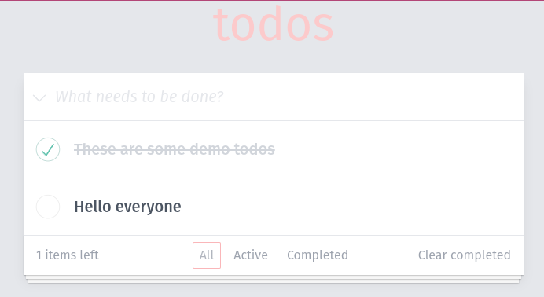
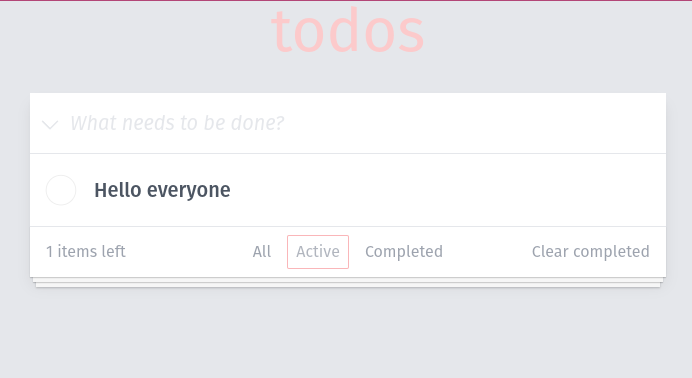
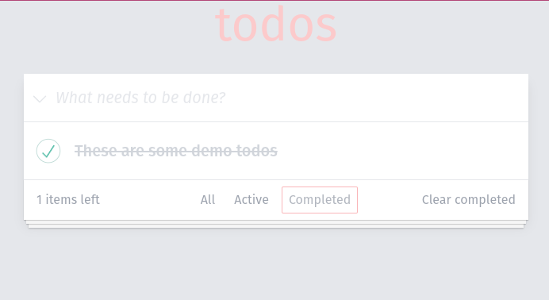

# Introduction

The following is a simple Todo app built with Nuxt 3 and Java Spring.

## Tech Stack

### Frontend

- Nuxt 3
- Tailwind CSS
- vitest
- Vue 3 w/ composition API

### Backend

- Spring Boot
- MariaDB
- H2 (Testing DB)
- Java 19
- MySQL connector
- JPA

## Prerequisites

To run the application, you need:

Pnpm as a package manager for the frontend environment (https://pnpm.io/)
Docker and Docker Compose to run the database locally

## Getting started

1. Start the database locally: Change directory to /server and run `docker-compose up -d`.
2. Make sure the server and database are running. To do this, run "TodomvcApplication.java" located at `server/src/main/java/com/yourasset/todomvc/TodomvcApplication.java`.
3. Go to `/frontend` and run `pnpm i` to install the required packages.
4. After that, run `pnpm dev` to start the frontend.

# Implementation solution

## Backend

The backend is structured based on the N-Tier model for clean separation of concerns:

- `TodoService` handles the business logic.
- `TodoRepository` provides TodoService access to JPA functions and custom SQL queries.
- `TodoController` handles incoming REST requests and forwards them to TodoService when necessary.
- `Todo` represents a todo object that is synced to the database through Jackson. It handles object-level operations such as changing the todo title or getting the id of a todo.
- `[...]Exception` handles custom exceptions such as bad REST requests or failure to find todos.

## Frontend

The frontend is divided into pages that list desired todos (all, active, completed). Each component handles different operations, including REST calls and UI changes. A "smart component" approach has been chosen, so components also handle logic, not just UI templates.

### Components

- `ChevronDown`, `Circle`, `CircleChecked`, `X` Return SVG icons.
- `TodoItemsWrapper` A purely visual component that wraps todo items and adds style.
- `TodoControls` The footer of the todo application. Handles page switches, shows remaining active todos, and clears completed todos if they exist.
- `TodoInput` Adds an input field to the UI where a user can add a todo. Calls the backend upon adding a todo. Also can toggle all todos.
- `TodoItem` Displays a single todo. Allows editing of a todo, calls the backend to change the title, check or delete a todo. Receives title, id, and status (isCompleted) as props from the parent page.

### Pages

- `app` The layout of the whole application. Wraps all todo items with `TodoInput` and `TodoControls` as well as the title
- `error` Shown if the backend is not running.
- `active` Shows all active todos.
- `all` Shows all todos, regardless of status.
- `completed` Shows all completed todos.
- `index` Redirects to `app/all

# Testing

## Backend

The backend has been thoroughly tested using two types of unit tests. The `TodoRepositoryTest` verifies the custom SQL queries using a test database powered by "H2". Meanwhile, the `TodoServiceTest` focuses on testing the service class by mocking the repository operations.

## Frontend

The frontend is being tested using vitest, a library that is compatible with Jest. To run tests in Nuxt 3, a special module called nuxt-vitest is required. Vitests usually run in an isolated environment, such as `jsdom` or `node`, but in the case of Nitro, some tests must be run in a `nuxt` isolated environment. However, this module is relatively new and running the test for the `TodoControls` component can lead to incorrect results or cause the entire test execution to freeze. As a result, the unit test for the `TodoControls` component has been omitted.

### Possible solution & further steps

One possible solution may be to investigate if there are any workarounds or fixes for the current issues with the `TodoControls` component unit tests, or to see if a different testing approach can be taken to ensure that all components and pages work well together.

In order to ensure the proper functioning of all components and pages, conducting integration tests or End-to-End (E2E) tests would be a worthwhile next step. Unfortunately, the popular testing framework Cypress is not yet supported by Nuxt version 3. Thus, it might be beneficial to explore alternative testing libraries that offer similar functionality.

# Showcase 

